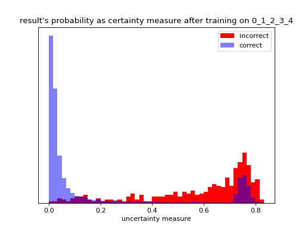

# Transforming catastrophic interference into uncertainty

### Continual learning landscape

I have identified five strategies to deal with destructive interference in continual learning systems.

- 1. Preventive strategies against interference
  - A. reducing its frequency, i.e. not allowing interference at every time step of the training process.
  - B. reducing its scope, i.e. preventing interference from reaching critical constituents of the model.
  - C. reducing its intensity, i.e. minimizing the amplitude of catastrophic forgetting.
- 2. Counter-measures
  - D. experience replay/rehearsal
  - E. factoring interference into the decision process, e.g. lessening the causal power of perturbed hidden representations.

Implementing A or B usually entails freezing entire modules,
as in [my previous project](https://github.com/rom1mouret/mpcl).

A great deal of research is focused on C, often by the means of regularization.

Strategy E is the focus of this README file.

### Catastrophic interference in action

Conventional neural networks do not forget in a graceful way.
A graceful/healthy way of forgetting would be for hidden representations to lose
their sharpness, slowly fading out and eventually becoming unproductive.

For instance, if a classifier utilizes a color detection module that has
partially forgotten what "yellow" is, it may guesstimate that
a photographed canary "is between yellow and green thus it might be a canary or a warbler".
In the worst case scenario, if the color circuit is damaged beyond repair, the
classifier would fall back on different sensory cues altogether and still be able
to make a reasonable guess as to which species it is.

We wouldn't want the classifier to spectacularly fail to categorize the photographed
bird because of a faulty, over-confident color module, e.g. "it's definitely pink so it *has* to
be a flamingo". And yet that's what SOTA neural networks typically output as they carelessly make
inferences from perturbed representations.

When representations lose precision because of interference, downstream modules
must switch to more reliable representations. Of course, this is only
possible if the system can detect unreliable representations to begin with.

Here is an example of catastrophic interference on MNIST with a 2-dimension latent layer.

<p align="center">
  
</p>

The neural network was first trained on digits 0, 1, 2, 3, 4.
Then it was trained on digits 5, 6, 7, 8, 9, thereby interfering with the
representations of 0, 1, 2, 3, 4.
As a consequence, the latent representation of '4' has drifted and now overlaps
with other digits. If it overlaps too much, the neural network will be confident
that '4' is a '1' or '3'.

Other training rounds: [latent_representation_1.png](images/latent_representation_1.png),
[latent_representation_2.png](images/latent_representation_2.png),
[latent_representation_4.png](images/latent_representation_4.png)


### Confidence level

You might think that the probability of a prediction is indicative of whether
its corresponding latent representation has drifted due to interference.



As shown above, before interference, misclassification correlates well with low confidence.
Perturbed digits will likely be misclassified, therefore it is reasonable to expect
that they will be misclassified with low confidence as well.

Unfortunately, that correlation doesn't hold true after interference.
After training the network to recognize new digits, confidence is no longer
a good proxy for classification accuracy.


conclusion: classification confidence is not a good metric to inform downstream modules
that some hidden representations are unreliable, at least in low-dimensional space
wherein there is a higher chance of representation overlap. (I haven't tried
with more dimensions.)

### Ensemble approach for multi-headed networks

Someone will hopefully come up with a Bayesian approach to transform interference
into uncertainty.
In the meantime, I'm going to grab the lowest hanging fruit and propose a simple
ensemble approach. It's not a flawless approach as it requires
knowing task boundaries and doesn't make neural networks gracefully forget,
but it does at least somewhat achieve its goal of detecting unreliable representations.

Let us start with the 2-task 3-processor case.
Create Ensemble1 for task1 and Ensemble2 for task2.
Ensemble1 and Ensemble2 are both made of 2 feature processors, one of which is
shared between Ensemble1 and Ensemble2 such that updating Ensemble2
will interfere with half of Ensemble1.

The feature processors are trained separately. To sum up:

1. Train [processor1, classifier1] on task1
2. Train [processor2, frozen(classifier1)] on task1
3. Train [processor3, classifier2] on task2
4. Train [processor1, frozen(classifier2)] on task2

Step 4 interferes with task1 because processor1 is shared.
To detect unreliable representations for task1, one can measure the distance
between the outputs of processor1 and processor2.
When there are more than 2 processors, we replace the pairwise distance with
standard deviation.

This is before interference:


After interference:


You can see that the standard deviation has significantly increased due to interference.

#### Scaling to more than two tasks

There is no optimal layout for more than two tasks.
It is going to be a trade-off between:

- having every task share a processor with every other task in order to maximally mutualize the models of the CL system.
- having every task share a processor with a single other task in order to minimize interference.

In the N-task setting, one can allocate processors to tasks using the following algorithm.

```python3
M = 2 # average number of shared processors per task
K = 1 # number of unshared processors per task
tasks = [[Processor() for _ in range(K)] for _ in range(N)]
for i, task in enumerate(tasks):
    new_tasks = M // 2
    if M % 2 == 1:
        new_tasks += random.randint(0, 1)
    for _ in range(new_tasks):
        shared = Processor()
        joint_task = random.choice(tasks[:i]+tasks[i+1:])
        joint_task.append(shared)
        task.append(shared)
```

### Implementation details

Entry point of the script: [<run_experiment.py>](run_experiment.py)

- It would have been easier to compute the standard deviation of predictions
rather than that of latent representations.
But this would have weakened my analysis since the goal is to detect unreliable
representations, with or without a classifier.
- The classifier doesn't use softmax because softmax provides too many degrees
of freedom to latent representations, resulting in large
standard deviation even without interference.
